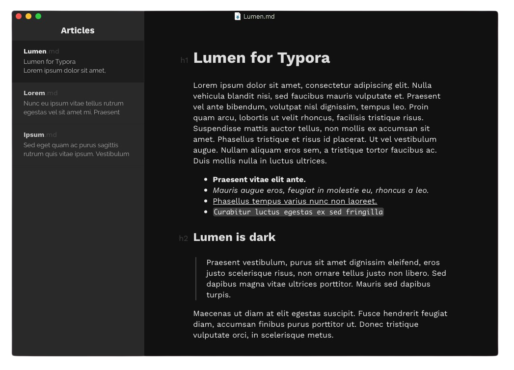

# Lumen for Typora

Lumen is a dark theme for [Typora markdown text editor](https://typora.io). Lumen is based on the excellent Lostkeys theme.

Lumen has only been tested on macOS, but should work fine on Linux systems as well.

## Installing Lumen

See Typora support on [how to install themes](http://support.typora.io/About-Themes/)

## Caveats

* Math blocks are not tested

* Code blocks are still somewhat to-do

* Some issues and to-do improvements in the side-bar

* Fonts not included yet

* Monospaced fonts use Monaco; incompatible on Linux
